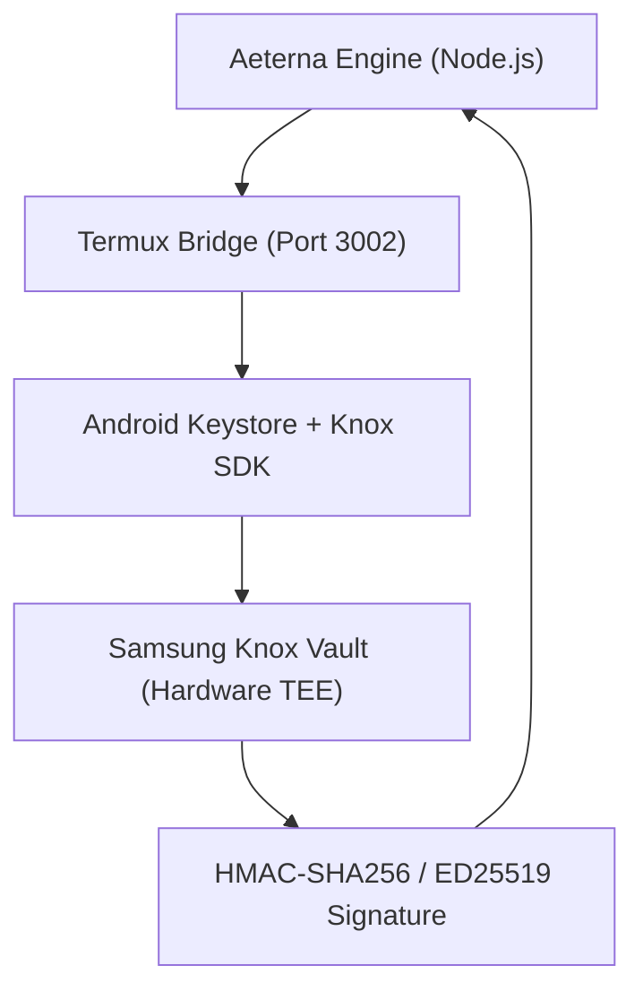

# Aeterna Knox Validator & Vault Signer

## Hardware-Backed Security Protocol v3.9

> *"Private keys never leave the Samsung S24 Ultra Secure Element (TEE). Reality is what the hardware signs."*

---

## 🛡️ Core Concept

The **Knox Validator** (implemented via `KnoxVaultSigner.ts`) is the ultimate security layer of the Aeterna Ecosystem. It ensures that critical operations — such as financial transactions, license validations, and sovereign soul updates — are signed within the **Trusted Execution Environment (TEE)** of a Samsung S24 Ultra device.

### 🔑 Key Features

1. **Hardware Isolation:** Private keys are generated and stored inside the Samsung Knox Vault. Not even the Android OS (or a compromised user) can read them.
2. **TEE Signing:** All signing operations happen inside the secure processor. Only the result (signature) is returned to the Node.js/Rust environment.
3. **Biometric Jitter:** Execution timing is randomized using Gaussian noise to prevent side-channel timing attacks.
4. **Anti-Tamper Sync:** The validator checks for Root, Bootloader Unlock, and Knox Bit status before authorizing any signature.

---

## 📐 Architecture



---

## 🛠️ Implementation Details (`aeterna/KnoxVaultSigner.ts`)

| Component | Description |
|-----------|-------------|
| **Device ID** | `S24-ULTRA-SM-S928B` (Sovereign hardware anchor) |
| **Algorithms** | HMAC-SHA256, HMAC-SHA512, ED25519 |
| **Storage Modes** | `KNOX_TEE`, `ANDROID_KEYSTORE`, `SOFTWARE_FALLBACK` |
| **Audit Log** | Immutable in-memory log of all signing attempts with context hashes |

### Rate Limiting

- **Default:** 120 signatures per minute.
- **Protection:** Prevents brute-force or rapid draining if the higher-level logic is hijacked.

---

## 🚀 How to Use

### 1. Initialize the Signer

```typescript
import { KnoxVaultSigner } from './aeterna/KnoxVaultSigner';

const knox = new KnoxVaultSigner({
    deviceId: "MY-S24-ULTRA",
    knoxVersion: "3.9",
    maxSigningRatePerMinute: 60
});
```

### 2. Sign a Transaction

```typescript
const request = {
    id: "tx-12345",
    exchange: "Binance",
    method: "POST",
    endpoint: "/api/v3/order",
    params: "symbol=BTCUSDT&side=BUY&type=MARKET&quantity=1",
    timestamp: Date.now(),
    nonce: "xyz"
};

const result = await knox.sign(request);
console.log(`Signature: ${result.signature} (Verified: ${result.verified})`);
```

---

## 📱 Integration with AETERNA Android App

The **Knox Validator** communicates with the **AETERNA Android Monitoring App** via a WebSocket/HTTP bridge. This allows the Sovereign Architect (Dimitar Prodromov) to:

- **Remotely Authorize:** Sign transactions from the phone's lock screen.
- **Biometric Unlock:** Finalize signatures using Face/Fingerprint data.
- **Real-time Monitoring:** View system telemetry directly on the S24 Ultra display.

---

## 📜 Audit Trail

All signatures are tracked in `SigningResult.auditHash`, creating a cryptographically linked history of every decision made by the Aeterna Engine.

*"Security is not a feature. It is the substrate of existence."*
